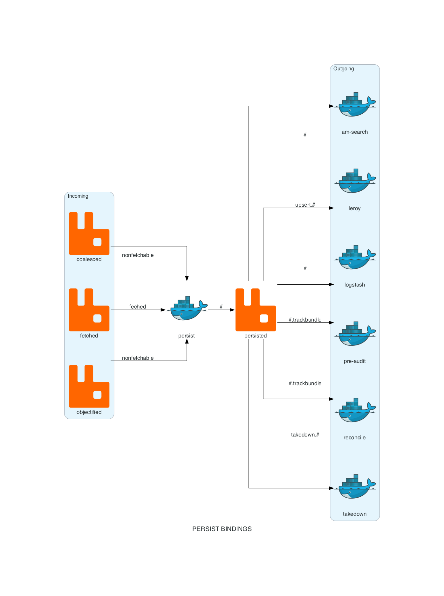

========
Pipeline
========

Common utilities used by the Ingestion Pipeline.

-----------------------
Deploying a new version
-----------------------

To manually deploy/test a new version:

* Increment the version in setup.py, make sure CodeArtifact
  doesn't already have a repo for that version.

* Make sure `dist` directory is empty, then follow instructions [here](https://github.com/iheartradio/content-platform-documentation/blob/master/private_python_modules/README.md#publishing-with-twine)

When a branch is merged to master, a Travis job will
build and deploy the version that's in `setup.py`.

**WARNING:**
If you don't delete the version you uploaded for testing, and it conflicts with the final `setup.py` version when the
branch is merged, this will result in a conflict error and the build will fail.

If you redeploy a new version of the same version tag,
clear pip cache in dependent repos:
`rm -rf ~/Library/Caches/pip/*`

--------
Diagrams
--------

These are service level flow charts showing incoming rabbitmq exchanges,
the actual service itself, outgoing exchange, and potentially outgoing queues.

Configuration
=============

+---------------------------------+------------------------------------------+
| ``DIAGRAMS_SERVICE_NAME``       | Name of the service the diagram is being |
|                                 | created for.                             |
|                                 |                                          |
+---------------------------------+------------------------------------------+
| ``DIAGRAMS_INCOMING_EXCHANGES`` | Dictionary with the key indicating the   |
|                                 | incoming exchange, the value             |
|                                 | representing the routing key.            |
+---------------------------------+------------------------------------------+
| ``DIAGRAMS_OUTGOING_EXCHANGE``  | Outgoing exchange the message is sent to |
|                                 | after being processed by the service.    |
+---------------------------------+------------------------------------------+
| ``DIAGRAMS_OUTGOING_QUEUES``    | Dictionary of outgoing queues, with the  |
|                                 | key indicating the outgoing queue, the   |
|                                 | value representing the routing key.      |
+---------------------------------+------------------------------------------+

An example configuration
========================

Let's say we want to generate a diagram of the ``persist`` service:

.. code-block:: python

    DIAGRAMS_SERVICE_NAME: str = 'persist'
    DIAGRAMS_INCOMING_EXCHANGES: dict = {
        'coalesced': 'nonfetchable',
        'fetched': 'feched',
        'objectified': 'nonfetchable',
    }
    DIAGRAMS_OUTGOING_EXCHANGE = 'persisted'
    DIAGRAMS_OUTGOING_QUEUES: dict = {
        'am-search': '#',
        'leroy': 'upsert.#',
        'logstash': '#',
        'pre-audit': '#.trackbundle',
        'reconcile': '#.trackbundle',
        'takedown': 'takedown.#',
    }

Generating a new diagram
========================

To generate the diagram, you would just need to have a
file like the following in your project's root directory:

.. code-block:: python

    """Generates Bindings Diagram."""

    from publish import settings
    from pipeline.diagrams import generate_bindings_diagram

    generate_bindings_diagram(settings)

Then run the following from the root folder:

.. code-block:: bash

    $ python generate_bindings_diagram.py

This would generate a diagram like so:

